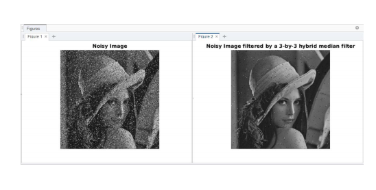

# Hybrid-Median-Filter-Image-proc.-

## Working

B = hmf (A, n) performs hybrid median filtering of the matrix A using an n x n box. Hybrid median filter preserves edges better than a square kernel (neighbour pixels) median filter because it is a three-step ranking operation: data from different spatial directions are ranked separately. Three median values are calculated: MR is the median of horizontal and vertical R pixels, and MD is the median of diagonal D pixels. The filtered value is the median of the two median values and the central pixel C: median ([MR, MD, C]). As an example, for n = 5:

### Hybrid median filter algorithm: 
1. Place a cross-window over element 
2. Pick up elements
3. Order elements 
4. Take the middle element
5. Place a + window over element 
6. Pick up elements
7. Order elements 
8. Take the middle element
9. Pick up result in point 4, 8 and element itself 
10. Order elements
11. Take the middle element.

For all window filters there is some problem. That is edge treating. If you place window over an element at the edge, some part of the window will be empty. To fill the gap,signal should be extended. For hybrid median filter there is good idea to extend image symmetrically. In other words we are adding lines at the top and at the bottom of the image and add columns to the left and to the right of it. A hybrid median filter has the advantage of preserving corners and other features that are eliminated by the 3 x 3 and 5 x 5 median filters. With repeated application, the hybrid median filter does not excessively smooth image details (as do the conventional median filters), and typically provides superior visual quality in the filtered image. One advantage of the hybrid median filter is due to its adaptive nature, which allows the filter to perform better than the standard median filter on fast moving picture information of small spatial extent. For all window filters there is some problem. That is edge treating. If you place window over an element at the edge, some part of the window will be empty. To fill the gap, signal should be extended. For hybrid median filter there is good idea to extend image symmetrically. In other words we are adding lines at the top and at the bottom of the image and add columns to the left and to the right of it. A hybrid median filter has the advantage of preserving corners and other features that are eliminated by the 3 x 3 and 5 x 5 median filters. With repeated application, the hybrid median filter does not excessively smooth image details (as do the conventional median filters), and typically provides superior visual quality in the filtered image. One advantage of the hybrid median filter is due to its adaptive nature, which allows the filter to perform better than the standard median filter on fast-moving picture information of small spatial extent.
### Output 

