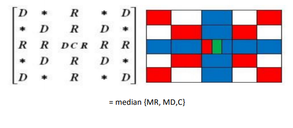

# Hybrid-Median-Filter-Image-proc.-

##Working

B = hmf (A, n) performs hybrid median filtering of the matrix A using an n x n box. Hybrid median filter preserves edges better than a square kernel (neighbour pixels) median filter because it is a three-step ranking operation: data from different spatial directions are ranked separately. Three median values are calculated: MR is the median of horizontal and vertical R pixels, and MD is the median of diagonal D pixels. The filtered value is the median of the two median values and the central pixel C: median ([MR, MD, C]). As an example, for n = 5:

